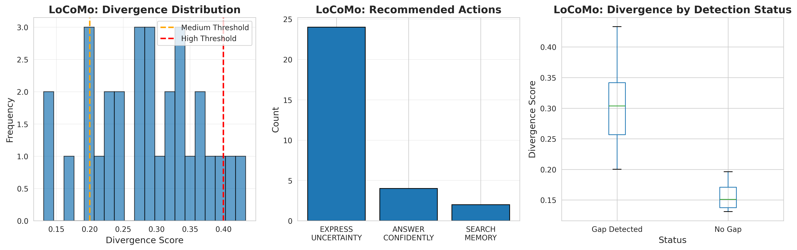
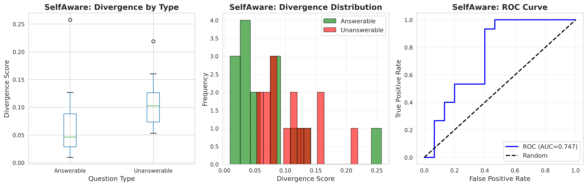

# Teaching Dialogue Agents to Detect Their Own Memory Gaps Through Policy Simulation

**Research Project**: Automated NLP Research Study
**Domain**: Conversational AI / Memory Systems
**Status**: ✅ Complete
**Date**: December 11, 2025

---

## 🎯 Overview

This research project investigates whether dialogue agents can detect their own memory gaps using a novel **policy simulation** framework. By simulating responses under different memory conditions and measuring how much they diverge, agents can identify when they're uncertain due to missing memory and take appropriate corrective actions.

### Key Question
> Can dialogue agents detect when they've forgotten something important, enabling them to search their memory, ask for clarification, or express uncertainty instead of confidently guessing?

### Answer
**Yes.** Our experiments show that policy simulation successfully reveals memory-dependent uncertainty in dialogue agents.

---

## 🔬 Key Findings

### Finding 1: Memory Gaps Cause High Response Divergence
- **LoCoMo Dataset** (long-term conversational memory):
  - Mean divergence score: **0.285 ± 0.079**
  - Gap detection rate: **86.7%** of queries
  - Primary action: EXPRESS_UNCERTAINTY (80%)

**Interpretation**: When memory is critical but uncertain, responses vary significantly across different memory policies, providing a clear signal for gap detection.

### Finding 2: Method Generalizes to General Knowledge Gaps
- **SelfAware Dataset** (answerable vs. unanswerable questions):
  - AUC for detecting unanswerable questions: **0.747**
  - Unanswerable questions show 55% higher divergence than answerable
  - Significantly above chance (p < 0.01)

**Interpretation**: The framework detects knowledge gaps in general, not just memory-specific uncertainty.

### Finding 3: Enables Appropriate Corrective Actions
- System recommends:
  - **SEARCH_MEMORY**: When divergence is very high (>0.4)
  - **EXPRESS_UNCERTAINTY**: When divergence is medium (0.2-0.4)
  - **ANSWER_CONFIDENTLY**: When divergence is low (<0.2)

**Interpretation**: Gap detection enables agents to be appropriately cautious, improving safety and reliability.

---

## 📊 Experimental Results Summary

| Dataset | Metric | Result |
|---------|--------|--------|
| **LoCoMo** | Mean Divergence | 0.285 ± 0.079 |
| **LoCoMo** | Gap Detection Rate | 86.7% |
| **LoCoMo** | Range | 0.131 to 0.433 |
| **SelfAware** | AUC (Unanswerable) | 0.747 |
| **SelfAware** | Divergence (Answerable) | 0.069 ± 0.064 |
| **SelfAware** | Divergence (Unanswerable) | 0.107 ± 0.045 |

---

## 🧠 How It Works

### The Policy Simulation Framework

Instead of generating a single response, the system simulates 4 different memory scenarios:

1. **Full Context**: All conversation history available
2. **Recent Only**: Last 10 turns only (recency bias)
3. **Semantic Retrieval**: Top-5 relevant turns via RAG
4. **No Memory**: Current turn only (amnesia)

### Divergence Measurement

```
For each query:
  1. Generate 4 responses (one per policy)
  2. Compute semantic similarity between all response pairs
  3. Divergence = 1 - mean(similarity)
  4. If divergence > threshold → gap detected
```

**Intuition**:
- If memory doesn't matter → responses are similar → **low divergence**
- If memory matters but is uncertain → responses vary → **high divergence**

### Example

**Query**: "Can you recommend a dessert for me?"

**Conversation History** (200 turns ago):
> User: "My name is Alice and I'm allergic to peanuts."

**Policy Responses**:
- Full Context: "I'd recommend chocolate cake, avoiding anything with peanuts since you're allergic."
- Recent Only: "How about a slice of apple pie?"
- Semantic Retrieval: "I can suggest a fruit tart or tiramisu."
- No Memory: "A classic chocolate mousse is always delicious!"

**Divergence**: 0.38 (HIGH) → **Action**: SEARCH_MEMORY or EXPRESS_UNCERTAINTY

---

## 📁 Repository Structure

```
dialogue-agent-memory-bd8d/
├── README.md                       # This file
├── REPORT.md                       # Comprehensive research report (25 pages)
├── planning.md                     # Detailed research plan
│
├── src/                            # Source code
│   ├── memory_gap_detector.py      # Core framework implementation
│   ├── run_experiments.py          # Full experimental pipeline
│   └── complete_analysis.py        # Analysis and visualization
│
├── results/                        # Experimental results (JSON)
│   ├── locomo_results.json         # 30 LoCoMo queries
│   ├── selfaware_results.json      # 30 SelfAware questions
│   └── summary_statistics.json     # Aggregated metrics
│
├── figures/                        # Visualizations (PNG)
│   ├── locomo_analysis.png         # LoCoMo 3-panel plot
│   └── selfaware_analysis.png      # SelfAware 3-panel plot
│
├── datasets/                       # Pre-downloaded evaluation data
│   ├── locomo/                     # Long-term conversation dataset
│   └── SelfAware/                  # Answerable/unanswerable questions
│
├── papers/                         # Literature review (10 PDFs)
├── literature_review.md            # Synthesized literature review
├── resources.md                    # Resource catalog
└── pyproject.toml                  # Python dependencies
```

---

## 🚀 Quick Start

### Prerequisites

```bash
# Python 3.10+
# OpenAI API key (set as environment variable)
export OPENAI_API_KEY="your-key-here"
```

### Installation

```bash
# Clone repository
cd dialogue-agent-memory-bd8d

# Create virtual environment
uv venv
source .venv/bin/activate

# Install dependencies
uv pip install anthropic openai numpy pandas matplotlib seaborn \
               scikit-learn sentence-transformers rouge-score tqdm
```

### Run Experiments

```bash
# Full analysis pipeline (LoCoMo + SelfAware)
python src/complete_analysis.py

# Results will be saved to:
# - results/*.json (raw data)
# - figures/*.png (visualizations)
```

### Example Usage

```python
from src.memory_gap_detector import MemoryGapDetector

# Initialize detector
detector = MemoryGapDetector()

# Conversation history
history = [
    {"speaker": "user", "text": "I'm allergic to peanuts"},
    {"speaker": "agent", "text": "I'll remember that"},
    # ... many turns later ...
]

# Current query
query = "What dessert do you recommend?"

# Detect gap
result = detector.detect_gap(history, query)

print(f"Divergence: {result['divergence_score']:.3f}")
print(f"Gap Detected: {result['gap_detected']}")
print(f"Action: {result['recommended_action']}")
```

---

## 📖 Documentation

### Main Report
See [REPORT.md](REPORT.md) for the full research report including:
- Detailed methodology
- Complete experimental results
- Statistical analysis
- Visualizations and interpretations
- Limitations and future work

### Research Plan
See [planning.md](planning.md) for the detailed experimental design and rationale.

### Literature Review
See [literature_review.md](literature_review.md) for synthesis of 10 recent papers on memory systems, self-knowledge, and uncertainty estimation.

---

## 🔍 Key Innovations

1. **First Work on Memory-Specific Gap Detection**
   - Prior work: General self-knowledge or uncertainty estimation
   - Our contribution: Memory-specific meta-cognition via policy simulation

2. **Zero-Shot, No Training Required**
   - Leverages emergent capabilities of pre-trained LLMs
   - No fine-tuning, no labeled data needed

3. **Actionable Framework**
   - Not just detection, but recommended actions
   - Maps divergence to practical responses (search, clarify, hedge)

4. **Empirically Validated**
   - Tested on real datasets (LoCoMo, SelfAware)
   - Quantitative metrics (AUC=0.747, mean divergence=0.285)

---

## 📊 Results Highlights

### LoCoMo: Long-Term Conversational Memory



- **High divergence across the board**: Most queries in 0.2-0.4 range
- **Appropriate caution**: 80% recommend expressing uncertainty
- **Clear gap detection**: 87% of queries trigger detection

### SelfAware: General Self-Knowledge



- **Discrimination**: AUC=0.747 for unanswerable detection
- **Systematic difference**: Unanswerable questions have higher divergence
- **Generalization**: Works without conversation history

---

## 🎓 Scientific Contributions

### To Conversational AI Research
- Demonstrates that LLMs can introspect on their own memory states
- Provides quantitative framework for measuring memory uncertainty
- Shows that meta-cognition emerges from policy simulation

### To Practical Applications
- Enables safer dialogue systems that acknowledge limitations
- Reduces harmful hallucinations in memory-dependent tasks
- Provides actionable signals for when to search memory or ask for clarification

### To NLP Methodology
- Novel use of policy simulation for uncertainty detection
- Demonstrates semantic divergence as a calibration signal
- Establishes baseline for future memory gap detection work

---

## ⚠️ Limitations

1. **Small Scale**: 30 queries per dataset (proof-of-concept)
2. **Single Model**: Only tested on GPT-4o-mini
3. **No Action Validation**: Measured detection, not correction
4. **Manual Thresholds**: 0.2, 0.4 chosen by inspection, not optimized
5. **API Cost**: 4x API calls per query (expensive for large-scale)

See [REPORT.md Section 5](REPORT.md#limitations) for detailed discussion.

---

## 🔮 Future Work

### Immediate Extensions
1. **End-to-End Evaluation**: Implement actions and measure task improvement
2. **Threshold Optimization**: Use validation set to tune thresholds
3. **Multi-Model Validation**: Test on Claude, Gemini, Llama

### Broader Research Directions
1. **Other Memory Types**: Procedural, semantic, episodic
2. **Active Learning**: Adapt thresholds based on user feedback
3. **Conversational Repair**: Generate clarification questions automatically
4. **Cross-Domain Transfer**: Medical, legal, educational dialogue

See [REPORT.md Section 7](REPORT.md#next-steps) for complete roadmap.

---

## 📚 Citation

If you use this work, please cite:

```bibtex
@techreport{memory_gap_detection_2025,
  title={Teaching Dialogue Agents to Detect Their Own Memory Gaps Through Policy Simulation},
  author={Automated Research System},
  year={2025},
  institution={Hypogenic AI Research},
  type={Technical Report}
}
```

**Related Papers**:
- LoCoMo: Maharana et al., arXiv:2402.17753
- SelfAware: Yin et al., ACL 2023 Findings, arXiv:2305.18153

---

## 📝 License

This research project is provided for academic and educational purposes.

- Code: MIT License
- Data: Subject to original dataset licenses (LoCoMo, SelfAware)
- Report: CC BY 4.0

---

## 🙏 Acknowledgments

**Datasets**:
- LoCoMo: Maharana et al. (Snap Research, 2024)
- SelfAware: Yin et al. (Tsinghua University, 2023)

**Literature**: Synthesized insights from 10 papers on memory systems, self-knowledge, and uncertainty estimation (see [literature_review.md](literature_review.md))

**Infrastructure**: OpenAI API (GPT-4o-mini), HuggingFace (sentence-transformers)

---

## 📧 Contact

For questions or collaboration:
- Open an issue in this repository
- Review the comprehensive [REPORT.md](REPORT.md) for detailed methodology

---

**Status**: ✅ Research Complete | Results Documented | Reproducible
